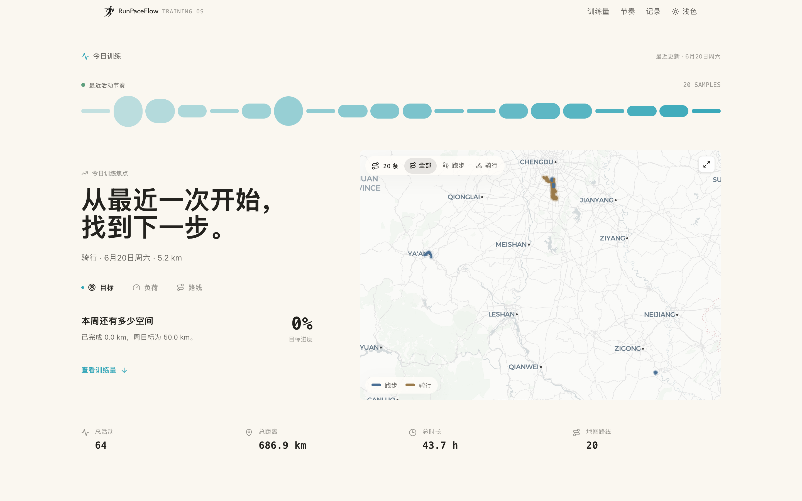
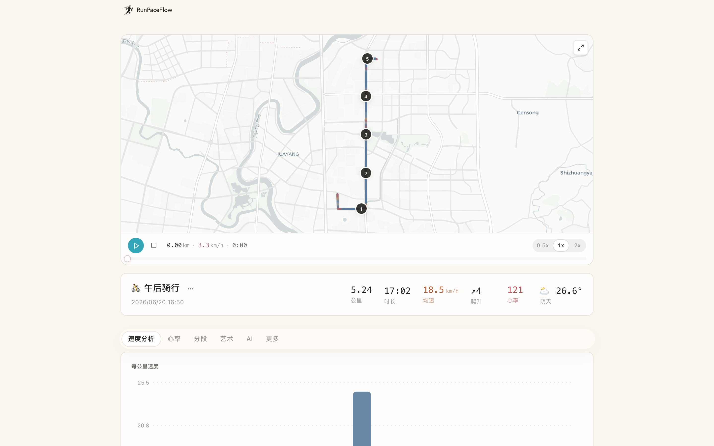

<p align="center">
  
</p>

# RunPaceFlow

Personal running data visualization app for activities managed by RunPaceFlow Admin.

[中文文档](./docs/README_CN.md)

<p align="center">
  
</p>

<p align="center">
  
</p>

## Features

- Read-only dashboard for running and cycling activities already stored in the activity database
- Map route visualization with animated playback
- Split pace analysis and charts
- AI-powered running insights (Claude / OpenAI-compatible API with automatic fallback)
- Lazy-loaded map components and optimized bundle size
- Runtime configuration loaded from RunPaceFlow Admin
- Responsive design for desktop and mobile

## Data Ownership

RunPaceFlow does not ingest or sync activity data directly. Data ingestion, third-party platform credentials, PR Agent workflows, and runtime settings are managed by RunPaceFlow Admin. This app reads the shared activity database and renders the public training experience.

## Configuration

Create a `.env.local` file:

```bash
# Required when reading runtime settings from RunPaceFlow Admin
RUNPACEFLOW_ADMIN_URL=http://localhost:3030
CONFIG_EXPORT_TOKEN=your_export_token

# Optional direct database fallback
DATABASE_URL=file:./data/activities.db
DATABASE_AUTH_TOKEN=

# Optional map style
NEXT_PUBLIC_MAP_STYLE=https://basemaps.cartocdn.com/gl/positron-gl-style/style.json

# Claude AI (optional - primary AI provider)
ANTHROPIC_API_KEY=your_api_key
ANTHROPIC_BASE_URL=  # Optional: custom API endpoint for proxy

# OpenAI-compatible API (optional - fallback AI provider)
# Supports OpenAI, DeepSeek, Tongyi Qwen, and other compatible APIs
OPENAI_API_KEY=your_api_key
OPENAI_BASE_URL=  # Required for third-party services (e.g. https://api.deepseek.com)
OPENAI_MODEL=  # Optional, defaults to gpt-4o
OPENAI_API_FORMAT=  # Optional: 'chat' (default) or 'responses'

# Goals (optional - customize weekly/monthly targets)
NEXT_PUBLIC_WEEKLY_DISTANCE_GOAL=10000
NEXT_PUBLIC_MONTHLY_DISTANCE_GOAL=50000
NEXT_PUBLIC_WEEKLY_DURATION_GOAL=3600
NEXT_PUBLIC_MONTHLY_DURATION_GOAL=18000
```

### AI Setup (Optional)

The AI feature generates personalized running insights for each activity, analyzing your pace, splits, and performance patterns. Supports multiple providers with automatic fallback:

- **Claude** (primary) requires `ANTHROPIC_API_KEY`
- **OpenAI-compatible** (fallback) requires `OPENAI_API_KEY`, supports OpenAI, DeepSeek, Tongyi Qwen, etc.

If Claude fails or is unavailable, the system automatically tries the OpenAI-compatible provider.

> Note: Without any AI provider configured, the app works normally but without AI insights.

## Local Development

```bash
# Install dependencies
bun install

# Apply database migrations when using a local SQLite database
bun run db:migrate

# Start dev server
bun run dev
```

Visit http://localhost:3000

## Deployment

Configure the same environment variables in your deployment platform. In production, point `RUNPACEFLOW_ADMIN_URL` and `CONFIG_EXPORT_TOKEN` to the admin instance, or provide `DATABASE_URL` / `DATABASE_AUTH_TOKEN` directly.

## Credits

Inspired by [yihong0618/running_page](https://github.com/yihong0618/running_page)

## License

MIT
